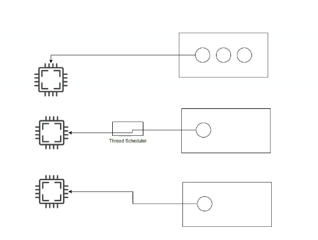
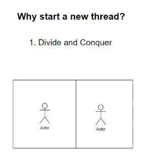
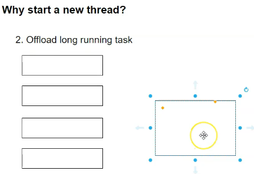

# Net Multithreading
.NET Multithreading
## CPU, Thread and Thread Scheduler
- CPU can only process a thread, so a thread is a basic unit that can run inside the CPU.
- CPU cant run the whole application
- One application needs to have atleast one thread
- Without a thread, application wont exist, it cant perform any task
- An application has a main thread
- When application is loaded into memory the main thread is assigned to the CPU and the application can run
- It is the job of thread scheduler that looks at the available application and assigns thread to the CPU 
- Thread is the basic unit that CPU can process
- We can have multiple applications running within a computer
- Thread Scheduler decides which thread should be allocated to CPU to process
- It makes the decision based on several factors, for e.g some applications are more mission critical than other applications, so their thread has higher priority
- If a high priority thread is assigned to CPU but it is not doing anything thread scheduler can remove the thread and assign another thread for time being
- This is called time-slicing. 
- Thread scheduler, the developer cannot influence. It is part of the OS.
- Multi-threading is when one application has multiple threads
- Thread scheduler only sees threads
- It assigns threads to CPU to process based on the thread scheduling algorithms
- In a multi-core CPU, we may be able to process multiple threads in different CPUs 
- Now Thread scheduler can assign one thread per core 
- 

## Basic syntax of using threads
- A thread needs to perform certain task
- So we need to assign a C# delegate(which is the name of the function or the method) that the thread needs to run
```c#
    void WriteThreadId()
{
    for (int i = 0; i < 100; i++)
    {
        Console.WriteLine(Thread.CurrentThread.ManagedThreadId);
        Thread.Sleep(50);
    }
}

WriteThreadId();

Thread thread1 = new Thread(WriteThreadId);
thread1.Start();

Thread thread2 = new Thread(WriteThreadId);
thread2.Start();

Console.ReadLine();
```
- In the above code, the WriteThreadId() method in the main thread is blocking. It has to be completed before thread1 and thread2 can start
- How threadIds are printed in thread1 and thread2 depends on CPU scheduler. There is no particular pattern is this.
- Thread scheduler is working to assign different threads within the application to the CPU.
- We can influence the thread scheduler in different ways:
- We can assign priority to threads like this:
```c#


void WriteThreadId()
{
    for (int i = 0; i < 100; i++)
    {
        Console.WriteLine(Thread.CurrentThread.ManagedThreadId);
        //Thread.Sleep(50);
    }
}


Thread thread1 = new Thread(WriteThreadId);
Thread thread2 = new Thread(WriteThreadId);

thread1.Priority = ThreadPriority.Highest;
thread2.Priority = ThreadPriority.Lowest;
Thread.CurrentThread.Priority = ThreadPriority.Normal;
thread1.Start();
thread2.Start();

WriteThreadId();

Console.ReadLine();

```
- We can also do time-slicing by introducing Thread.Sleep(50)
- In this case, if a task is taking too long to finish, CPU scheduler will kick it out of CPU and put in another thread to process
- In this case assigning priority to threads wont really work. 
- We can assign names to the threads like this
```c#
    thread1.Name = "Thread1";
    thread2.Name = "Thread2";
    Thread.CurrentThread.Name = "MainThread";
```
## Why we do we need to start a new Thread?
- **Solve divide and conquer type of problems**
- If we have a big task, we can divide the task into multiple smaller chunks so multiple people can work on it on parallel
- 
- Lets say we have an array with 10 elements from 1- 10, if we do their sum and print out the time taken we can do it like this
```c#
int[] array = { 1, 2, 3, 4, 5, 6, 7, 8, 9, 10 };
int sum = 0;
var startTime = DateTime.Now;
foreach (int i in array)
{
    Thread.Sleep(100);
    sum += i;
}
var endTime = DateTime.Now;
var timespan = endTime - startTime;
Console.WriteLine($"Time taken = {timespan.TotalMilliseconds}"); //Output of 1100 milliseconds
```
- This will take about 1100 seconds for a single thread to calculate and display the sum of 10 numbers to the user
- Now we can divide this array into multiple segments and have each segment processed by a different thread
```c#
 int[] array = { 1, 2, 3, 4, 5, 6, 7, 8, 9, 10 };
int SumSegment(int start,int end)
{
    int segmentSum = 0;
    for (int i = start; i < end; i++)
    {
        Thread.Sleep(100);
        segmentSum += array[i];
    }
    return segmentSum;
}

int sum1 = 0,sum2 = 0,sum3 = 0,sum4 = 0;

var startTime = DateTime.Now;
int numOfThreads = 4;
int segmentLength = array.Length / numOfThreads;
Thread[] threads = new Thread[numOfThreads];
threads[0] = new Thread(() => { sum1 = SumSegment(0, segmentLength); });
threads[1] = new Thread(() => { sum2 = SumSegment(segmentLength, 2* segmentLength); });
threads[2] = new Thread(() => { sum3 = SumSegment(2* segmentLength, 3* segmentLength); });
threads[3] = new Thread(() => { sum4 = SumSegment(3* segmentLength, array.Length); });

foreach (var thread in threads)
{
    thread.Start();
}

foreach (var thread in threads)
{
    thread.Join();
}

var endTime = DateTime.Now;
var timespan = endTime - startTime;

Console.WriteLine($"The sum is {sum1 + sum2 + sum3 + sum4}"); 
Console.WriteLine($"Time taken = {timespan.TotalMilliseconds}"); //Outputs 440 milliseconds
Console.ReadLine();
```

- In the above code, we have divided the array into multiple segments with segment length equal to array length divided by number of threads = 4
- We calculate the sum of each segment into each of their individual threads and then join their results
- If we see the output here, time taken is 400 milliseconds which is faster than 1100 milliseconds taken earlier
- Therefore, by dividing our problem into multiple threads, we can process it much faster.

## Why threading: Offload long running tasks
- We can offload long running task to a different thread
- 
- Lets say we have a form with 2 buttons and each button displays some text inside a label in the form
 ```c#
public partial class Form1 : Form
{
    public Form1()
    {
        InitializeComponent();
    }

    private void button1_Click(object sender, EventArgs e)
    {
        ShowMessage("First Message", 3000);

    }

    

    private void button2_Click(object sender, EventArgs e)
    {
        ShowMessage("Second Message", 5000);

    }

    private void ShowMessage(string message, int delay)
    {
        Thread.Sleep(delay);
        lblMessage.Text = message;
    }
}

```
- In the above case each click is a long running task. It blocks the main thread and makes the UI unresponsive.
- To fix this, we need to run it in its own worker thread so that the main thread is not blocked

```c#
public partial class Form1 : Form
{
    public Form1()
    {
        InitializeComponent();
    }

    private void button1_Click(object sender, EventArgs e)
    {
        Thread thread = new Thread(() => ShowMessage("First Message", 3000));
       thread.Start();
    }

    

    private void button2_Click(object sender, EventArgs e)
    {
        Thread thread = new Thread(() => ShowMessage("Second Message", 5000));
        thread.Start();
    }

    private void ShowMessage(string message, int delay)
    {
        Thread.Sleep(delay);
        lblMessage.Text = message;
    }
}

```
