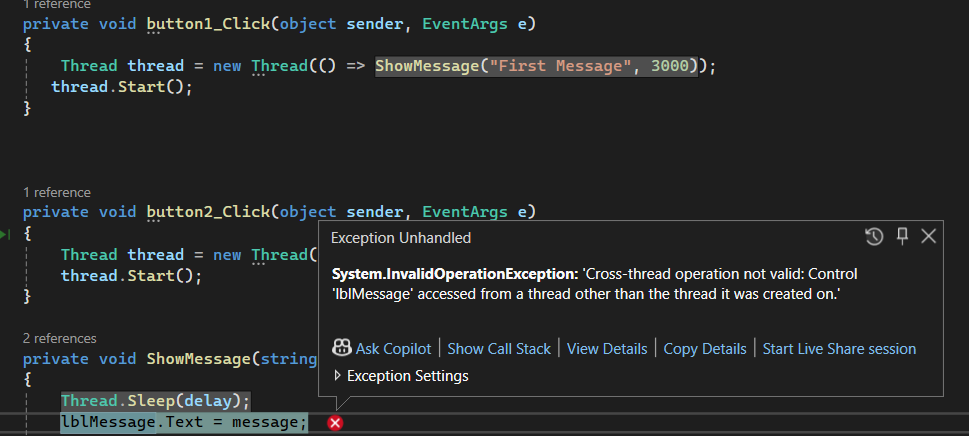

# Net Multithreading
.NET Multithreading
## CPU, Thread and Thread Scheduler
- CPU can only process a thread, so a thread is a basic unit that can run inside the CPU.
- CPU cant run the whole application
- One application needs to have atleast one thread
- Without a thread, application wont exist, it cant perform any task
- An application has a main thread
- When application is loaded into memory the main thread is assigned to the CPU and the application can run
- It is the job of thread scheduler that looks at the available application and assigns thread to the CPU 
- Thread is the basic unit that CPU can process
- We can have multiple applications running within a computer
- Thread Scheduler decides which thread should be allocated to CPU to process
- It makes the decision based on several factors, for e.g some applications are more mission critical than other applications, so their thread has higher priority
- If a high priority thread is assigned to CPU but it is not doing anything thread scheduler can remove the thread and assign another thread for time being
- This is called time-slicing. 
- Thread scheduler, the developer cannot influence. It is part of the OS.
- Multi-threading is when one application has multiple threads
- Thread scheduler only sees threads
- It assigns threads to CPU to process based on the thread scheduling algorithms
- In a multi-core CPU, we may be able to process multiple threads in different CPUs 
- Now Thread scheduler can assign one thread per core 
- 

## Basic syntax of using threads
- A thread needs to perform certain task
- So we need to assign a C# delegate(which is the name of the function or the method) that the thread needs to run
```c#
    void WriteThreadId()
{
    for (int i = 0; i < 100; i++)
    {
        Console.WriteLine(Thread.CurrentThread.ManagedThreadId);
        Thread.Sleep(50);
    }
}

WriteThreadId();

Thread thread1 = new Thread(WriteThreadId);
thread1.Start();

Thread thread2 = new Thread(WriteThreadId);
thread2.Start();

Console.ReadLine();
```
- In the above code, the WriteThreadId() method in the main thread is blocking. It has to be completed before thread1 and thread2 can start
- How threadIds are printed in thread1 and thread2 depends on CPU scheduler. There is no particular pattern is this.
- Thread scheduler is working to assign different threads within the application to the CPU.
- We can influence the thread scheduler in different ways:
- We can assign priority to threads like this:
```c#


void WriteThreadId()
{
    for (int i = 0; i < 100; i++)
    {
        Console.WriteLine(Thread.CurrentThread.ManagedThreadId);
        //Thread.Sleep(50);
    }
}


Thread thread1 = new Thread(WriteThreadId);
Thread thread2 = new Thread(WriteThreadId);

thread1.Priority = ThreadPriority.Highest;
thread2.Priority = ThreadPriority.Lowest;
Thread.CurrentThread.Priority = ThreadPriority.Normal;
thread1.Start();
thread2.Start();

WriteThreadId();

Console.ReadLine();

```
- We can also do time-slicing by introducing Thread.Sleep(50)
- In this case, if a task is taking too long to finish, CPU scheduler will kick it out of CPU and put in another thread to process
- In this case assigning priority to threads wont really work. 
- We can assign names to the threads like this
```c#
    thread1.Name = "Thread1";
    thread2.Name = "Thread2";
    Thread.CurrentThread.Name = "MainThread";
```
## Why we do we need to start a new Thread?
- **Solve divide and conquer type of problems**
- If we have a big task, we can divide the task into multiple smaller chunks so multiple people can work on it on parallel
- 
- Lets say we have an array with 10 elements from 1- 10, if we do their sum and print out the time taken we can do it like this
```c#
int[] array = { 1, 2, 3, 4, 5, 6, 7, 8, 9, 10 };
int sum = 0;
var startTime = DateTime.Now;
foreach (int i in array)
{
    Thread.Sleep(100);
    sum += i;
}
var endTime = DateTime.Now;
var timespan = endTime - startTime;
Console.WriteLine($"Time taken = {timespan.TotalMilliseconds}"); //Output of 1100 milliseconds
```
- This will take about 1100 seconds for a single thread to calculate and display the sum of 10 numbers to the user
- Now we can divide this array into multiple segments and have each segment processed by a different thread
```c#
 int[] array = { 1, 2, 3, 4, 5, 6, 7, 8, 9, 10 };
int SumSegment(int start,int end)
{
    int segmentSum = 0;
    for (int i = start; i < end; i++)
    {
        Thread.Sleep(100);
        segmentSum += array[i];
    }
    return segmentSum;
}

int sum1 = 0,sum2 = 0,sum3 = 0,sum4 = 0;

var startTime = DateTime.Now;
int numOfThreads = 4;
int segmentLength = array.Length / numOfThreads;
Thread[] threads = new Thread[numOfThreads];
threads[0] = new Thread(() => { sum1 = SumSegment(0, segmentLength); });
threads[1] = new Thread(() => { sum2 = SumSegment(segmentLength, 2* segmentLength); });
threads[2] = new Thread(() => { sum3 = SumSegment(2* segmentLength, 3* segmentLength); });
threads[3] = new Thread(() => { sum4 = SumSegment(3* segmentLength, array.Length); });

foreach (var thread in threads)
{
    thread.Start();
}

foreach (var thread in threads)
{
    thread.Join();
}

var endTime = DateTime.Now;
var timespan = endTime - startTime;

Console.WriteLine($"The sum is {sum1 + sum2 + sum3 + sum4}"); 
Console.WriteLine($"Time taken = {timespan.TotalMilliseconds}"); //Outputs 440 milliseconds
Console.ReadLine();
```

- In the above code, we have divided the array into multiple segments with segment length equal to array length divided by number of threads = 4
- We calculate the sum of each segment into each of their individual threads and then join their results
- If we see the output here, time taken is 400 milliseconds which is faster than 1100 milliseconds taken earlier
- Therefore, by dividing our problem into multiple threads, we can process it much faster.

## Why threading: Offload long running tasks
- We can offload long running task to a different thread
- 
- Lets say we have a form with 2 buttons and each button displays some text inside a label in the form
 ```c#
public partial class Form1 : Form
{
    public Form1()
    {
        InitializeComponent();
    }

    private void button1_Click(object sender, EventArgs e)
    {
        ShowMessage("First Message", 3000);

    }

    

    private void button2_Click(object sender, EventArgs e)
    {
        ShowMessage("Second Message", 5000);

    }

    private void ShowMessage(string message, int delay)
    {
        Thread.Sleep(delay);
        lblMessage.Text = message;
    }
}

```
- In the above case each click is a long running task. It blocks the main thread and makes the UI unresponsive.
- To fix this, we need to run it in its own worker thread so that the main thread is not blocked

```c#
public partial class Form1 : Form
{
    public Form1()
    {
        InitializeComponent();
    }

    private void button1_Click(object sender, EventArgs e)
    {
        Thread thread = new Thread(() => ShowMessage("First Message", 3000));
       thread.Start();
    }

    

    private void button2_Click(object sender, EventArgs e)
    {
        Thread thread = new Thread(() => ShowMessage("Second Message", 5000));
        thread.Start();
    }

    private void ShowMessage(string message, int delay)
    {
        Thread.Sleep(delay);
        lblMessage.Text = message;
    }
}

```

## Simulate a web server that handles concurrent requests
- 
- Lets say we have a web server that handles multiple requests
- We need to have a Monitor Queue that monitors the incoming requests and assigns them to a Request Processor
- If we do it in a single thread this would be blocking the user inputs till each input is processed
- We need to solve it using Divide and Conquer strategy
```c#

//Using a single thread
Console.WriteLine("Server is running. Type 'exit' to stop.");
while (true)
{
    string? input = Console.ReadLine();
    if (input?.ToLower() == "exit")
    {
        break;
    }
    ProcessInput(input);
}

static void ProcessInput(string? input)
{
    // Simulate processing time
    Thread.Sleep(2000);
    Console.WriteLine($"Processed input: {input}");
}

```
- We need to enqueue the request into the request queue.
- We need to have a monitor queue
- We need to process this request
- To accomplish this we have the following code:
```c#
using System.Net.Http.Headers;

Queue<string?> requestQueue = new Queue<string?>();

//2. Start the request monitoring thread
Thread monitoringThread = new Thread(MonitorQueue);
monitoringThread.Start();

//1. Enqueue the requests
Console.WriteLine("Server is running. Type 'exit' to stop.");
while (true)
{
    string? input = Console.ReadLine();
    if (input?.ToLower() == "exit")
    {
        break;
    }
    //main thread
    requestQueue.Enqueue(input);
}

void MonitorQueue()
{
    while (true)
    {
        if (requestQueue.Count > 0)
        {
            string? input = requestQueue.Dequeue();
            // Processing thread
            Thread processingThread = new Thread(() => ProcessInput(input));
            processingThread.Start();
        }
        Thread.Sleep(100);
    }
}


//3. Processing the requests
 void ProcessInput(string? input)
{
    // Simulate processing time
    Thread.Sleep(2000);
    Console.WriteLine($"Processed input: {input}");
}
```
- Notice above we have 3 threads, main thread for enqueuing requests, monitoring thread to monitor the queue of requests and processor thread to process the request
- Notice we have using Queue collection here. What if the CPU scheduler schedules the main thread and monitoring thread to work at the same time in different cores of CPU 
- In this case, we can have race conditions so we will have to use Threadsafe collections or Parallel Collections. 

## Thread Synchronization
- What if threads need to share some resources ?
- 
- We need to synchronize the threads to process them in parallel
- We need thread synchronization
- Lets say we have a counter variable and 2 threads are trying to increment it at the same time like this
```c#
int counter = 0;

Thread thread1 = new Thread(IncrementCounter);

//thread1.Join();
Thread thread2 = new Thread(IncrementCounter);
//Execute the threads in parallel at the same time
thread1.Start();
thread2.Start();

//Wait for both the threads to complete
thread1.Join();
thread2.Join();

Console.WriteLine($"Final Counter Value = {counter}");
Console.ReadLine();
void IncrementCounter()
{
    for (int i = 0; i < 100000; i++)
    {
        //assigment is not an atomic operation
        var temp = counter;
        counter = temp + 1;
    }
}

```
- In the above case we will have inconsistent output, the value of counter can be 200000 or 179541 etc.
- Here 2 threads are trying to share the same resource
- This kind of problems are called race conditions and inconsistent behaviors. How the Thread scheduler schedules the threads to run, it depends on it.
- In above case, final result changes several times every time we run it. Here threads are interfering with each other since they are sharing one resource(counter)
- Therefore, we need Thread synchronization

## Critical Section
- A critical section in multi-threading is like a VIP area in a club where only one person can enter at a time. It refers to a segment of code that accesses shared resources, such as variables, data structures, or hardware devices, which must not be concurrently accessed by multiple threads. 
- This ensures data integrity and avoids race conditions.
- **Exclusive Access**: Only one thread can enter the critical section at a time.
- **Mutual Exclusion**: Mechanisms like locks, semaphores, or mutexes are used to enforce exclusive access.
- By carefully managing access to critical sections, we ensure the integrity and consistency of shared resources in a multi-threaded environment.
- In the above code, following is the critical section as this accesses the shared resource: counter:
```c#
 var temp = counter;
 counter = temp + 1;
```
- If the code inside the critical section of code, is a single indivisible step, then there is no problem of thread synchronization.
- However if it is not atomic and there are multiple steps, then we need thread synchronization
- We need a mechanism to make code inside critical section as indivisible.

## Synchronization technique : Exclusive lock
```c#
lock()
{
    //critical section of code
}

```
- Body of lock can only be accessed by only one thread
- Makes operations within body of lock as atomic.
```c#
object counterLock = new object();

void IncrementCounter()
{
    for (int i = 0; i < 100000; i++)
    {
        lock (counterLock)
        {
            //assigment is not an atomic operation
            counter = counter + 1;
        }
    }
}

```

- In .NET 9(C# 13) instead of using an object type for counterLock use System.Threading.Lock 
```c#
System.Threading.Lock counterLock = new System.Threading.Lock();

```
## Assignment: Airplane Booking System
- web server for users to buy tickets
- 
- use letter b to book and letter c to cancel ticket
```c#


Queue<string?> requestQueue = new Queue<string?>();
int availableTickets = 10;

object ticketsLock = new object();

//2. Start the request monitoring thread
Thread monitoringThread = new Thread(MonitorQueue);
monitoringThread.Start();

//1. Enqueue the requests
Console.WriteLine("Server is running. \r\n Type 'b' to book a ticket. Type 'c' to cancel. \r\n Type 'exit' to stop.");
while (true)
{
    string? input = Console.ReadLine();
    if (input?.ToLower() == "exit")
    {
        break;
    }
    //main thread
    requestQueue.Enqueue(input);
}

void MonitorQueue()
{
    while (true)
    {
        if (requestQueue.Count > 0)
        {
            string? input = requestQueue.Dequeue();
            // Processing thread
            Thread processingThread = new Thread(() => ProcessBooking(input));
            processingThread.Start();
        }
        Thread.Sleep(100);
    }
}


//3. Processing the requests
void ProcessBooking(string? input)
{
    // Simulate processing time
    Thread.Sleep(2000);
    //Console.WriteLine($"Processed input: {input}");
    lock (ticketsLock)
    {
        if (input == "b")
        {

            if (availableTickets > 0)
            {
                availableTickets--;
                Console.WriteLine();
                Console.WriteLine($"Your seat is booked. {availableTickets} seats are still available");
            }
            else
            {
                Console.WriteLine("No tickets are available");
            }


        }
        else if (input == "c")
        {
            if (availableTickets < 10)
            {
                availableTickets++;
                Console.WriteLine();
                Console.WriteLine($"Your seat is cancelled. {availableTickets} seats are available");

            }
            else
            {
                Console.WriteLine("Cannot cancel booking. 10 or more tickets are already available");
            }
        }

    }   
}
```

## Monitor : Thread Synchronization technique
- Monitor monitors the critical section
- If one thread enters the critical section, monitor blocks other threads
- Monitor generates an exclusive lock
- Monitor gives more control compared to lock
- Monitor.Enter generates an exclusive lock
- Monitor.Exit is called at end of critical section to release the lock
- we use try {} finally{} mechanism
```c#
Monitor.Enter(lockObject)
try {
    //Your code here
}
finally {
    Monitor.Exit(lockObject)
}
```
- We can express our increment counter code as following:
```c#
void IncrementCounter()
{
    for (int i = 0; i < 100000; i++)
    {
        Monitor.Enter(counterLock);
        try
        {
            //assigment is not an atomic operation
             counter = counter + 1;
        }
        finally
        {
            Monitor.Exit(counterLock);
        }
    }
}

```
- Monitor has another feature called Waiting Timeout time
- Lets say there are multiple threads in operation and one thread is waiting to acquire an exclusive lock on the critical section
- In such a scenario, we may want to show a message to the user that the system is busy, Please wait. We can do it like this
- Here we use Monitor.TryEnter(ticketsLock, 2000). This means thread will try to acquire a lock for 2 seconds, if it is not able to get the lock, then it will give the error message to wait to the user
```c#
 void ProcessBooking(string? input)
{
    
    //Console.WriteLine($"Processed input: {input}");
    if(Monitor.TryEnter(ticketsLock, 2000))
    {
        try
        {
            // Simulate processing time
            Thread.Sleep(3000);
            if (input == "b")
            {

                if (availableTickets > 0)
                {
                    availableTickets--;
                    Console.WriteLine();
                    Console.WriteLine($"Your seat is booked. {availableTickets} seats are still available");
                }
                else
                {
                    Console.WriteLine("No tickets are available");
                }


            }
            else if (input == "c")
            {
                if (availableTickets < 10)
                {
                    availableTickets++;
                    Console.WriteLine();
                    Console.WriteLine($"Your seat is cancelled. {availableTickets} seats are available");

                }
                else
                {
                    Console.WriteLine("Cannot cancel booking. 10 or more tickets are already available");
                }
            }
        }

        finally
        {
            Monitor.Exit(ticketsLock);
        }
    }
    else
    {
        Console.WriteLine("The system is busy. Please wait");
    }


}

```
- Both lock and Monitor acquire an exclusive lock on the critical section

## Mutex: Thread Synchronization Mechanism
- Similar to lock or Monitor 
- Creates a lock around critical section
- Syntax is similar to monitor
```c#
using(var mutex = new Mutex())
{
    //ownership of mutex and critical section
    //Used to acquire mutex
    mutex.WaitOne();
    try{
        //critical section
    }
    finally
    {
        mutex.ReleaseMutex();
    }
}
```
- If we already have lock and monitor why we need mutex?
- **Mutex can not only be used within the process but it can be used across processes also**
- 
- Each app can have different processes and each process can have different threads inside it
- 
- We usually have multiple processes in each application to improve its performance
- **For e.g in a browser, each tab could be in a different process**
- From an architecture point of view, this is a better separation of concerns.
- From performance point of view, we could utilize multiple cores in the CPU 
- When multiple processes access the same resource, it can cause race conditions. Here we cant use monitor or lock anymore coz they are limited to the same process. So we need mutex.
- The above code for mutex is for within the same process.
- To use mutex across processes use this syntax:
```c#
//Give the mutex a name to be used across processes
using(var mutex = new Mutex(false, "GlobalFileMutex))
{
    //ownership of mutex and critical section
    //Used to acquire mutex
    mutex.WaitOne();
    try{
        //critical section
    }
    finally
    {
        mutex.ReleaseMutex();
    }
}

```
- We use using statement so that we can dispose the mutex in the end as it is a resource in the OS.
- 
- If we go to bin/debug of our project and run the exe for console app twice, it will start 2 separate processes.
- Here the counter.txt file is the shared resource. Since Mutex helps us to keep a lock across processes, therefore value of counter inside the file would be 20000
```c#
string filePath = "counter.txt";

using (var mutex = new Mutex(false, "GlobalFileMutext"))
{
    for (int i = 0; i < 10000; i++)
    {
        mutex.WaitOne();
        try
        {
            int counter = ReadCounter(filePath);
            counter++;
            WriteCounter(filePath, counter);
        }

        finally
        {
            mutex.ReleaseMutex();
        }
    }
}


Console.WriteLine("Process finished");
Console.ReadLine();

int ReadCounter(string filePath)
{
    using (var stream = new FileStream(filePath, FileMode.OpenOrCreate, FileAccess.Read, FileShare.ReadWrite))
    using (var reader = new StreamReader(stream))
    {
        string content = reader.ReadToEnd();
        return string.IsNullOrEmpty(content) ? 0 : int.Parse(content);
    }
}

void WriteCounter(string filePath, int counter)
{
    using (var stream = new FileStream(filePath, FileMode.OpenOrCreate, FileAccess.Write, FileShare.ReadWrite))
    using (var writer = new StreamWriter(stream))
    {
        writer.Write(counter);
    }
}

```
- As we give mutex a name, it becomes global across all the processes.
- Within the process, use lock or monitor to protect critical section and across processes use Mutex.
- Remember mutexes are an operating system wide resource, it actually takes more resource to create a mutex than to create a lock or monitor


## Reader and Writer Lock: Another Thread Synchronization Technique
- lock, monitor, mutex are exclusive locks.
- the above locks affect performance of the application.
- 
- Suppose we have multiple Readers and Writer threads trying to access a shared resource
- We want that when we acquire a reader lock, then we can share the lock only across the reader threads but block all writer threads.
- So it is shared lock for reader threads but exclusive lock against the writer threads.
- The reader and writer lock has to work in such a way that allows multiple readers to read the resource simultaneously.
- When one of the reader threads, for example, acquires the lock, other reader threads should be able to acquire the lock at the same time so that they can work simultaneously.
- However, when any of the reader threads is holding onto the lock, the writer cannot actually do anything
- When writer thread is holding a lock, that lock is an absolute exclusive lock.
- In DB we use such locks a lot.
- In Sql Server we have shared locks and exclusive locks
- When SELECT statement is executed, a shared lock is applied to certain area of the table. We can lock rows or pages.
- UPDATE OR INSERT OR DELETE statements generate exclusive lock.
- 
- Another example is web-server 
- 
- We need similar locks on the shared cache for reading and writing.
- Lets say we have multiple users on the webserver being catered to by different threads.
- All of these threads are trying to read from shared cache.
```c#
 public class GlobalConfigurationCache
{
    private ReaderWriterLockSlim _lock = new ReaderWriterLockSlim();

    //Dictionary is not thread safe
    //Solve this problem using Concurrent Data Structures or ConcurrentDictionary
    private Dictionary<int, string> _cache = new Dictionary<int, string>();
    public void Add(int key, string value)
    {
        bool lockAcquired = false;
        try
        {
            //Exclusive lock, everyone else is blocked
            _lock.EnterWriteLock();
            lockAcquired = true;
            //Not an atomic operation, broken into multiple parts while being executed.
            _cache[key] = value;
        }
        finally
        {
            if (lockAcquired)
            {
                _lock.ExitWriteLock();
            }
        }
    }
    public string? Get(int key)
    {
        bool lockAcquired = false;
        try
        {
            //Allow different reader threads to access cache simultaneously
            _lock.EnterReadLock(); 
            lockAcquired = true;
            //not an atomic operation
            return _cache.TryGetValue(key, out var value) ? value : null;
        }
        finally 
        {
            if (lockAcquired)
            {
                _lock.ExitReadLock();
            }
        }
    }
}

```

## Semaphore : Thread synchronization technique, less often used for critical sections.
- Can be used to protect critical sections
- But it is used mostly to limit the number of concurrent threads or processes.
- 
- Remember the web server example where we had a monitor thread that monitors the queues and each time a request comes it used to create and start a new processing thread.
- Now if we have millions of such requests at any given time, we could start a million threads and it would place lot of stress on the server 
- To avoid this most web-servers have connection pools to limit the number of the concurrent connections
- For e.g in Azure Sql Server, the number of concurrent threads allowed is 100 by default.
- Semaphores can limit the number of concurrent threads.
```c#
using (SemaphoreSlim semaphore = new SemaphoreSlim(initialCount:3, maxCount: 3))
{
    semaphore.Wait();
    try {
        //use semaphore to limit access to this section
        //your code here
    }
    finally {
        semaphore.Release();
    }
}

```
- Semaphore Slim is lighter than Semaphore.
- **semaphore.Wait() and semaphore.Release() dont have to exist in the same thread**
- Compared to reader writer lock, lock, Monitor and Mutex which all have thread affinity(i.e they can be used within the same thread), semaphore doesnot have thread affinity.
- Since it doesn't have thread affinity, it can used from different threads.
- Semaphore slows down processing but protects application from overloading.
- Semaphore can be across processes also.
- Please note Semaphore can be used across processes but Semaphore Slim can be used only within a process.
```c#
 

Queue<string?> requestQueue = new Queue<string?>();
using SemaphoreSlim semaphore = new SemaphoreSlim(initialCount:3, maxCount: 3);

//2. Start the request monitoring thread
Thread monitoringThread = new Thread(MonitorQueue);
monitoringThread.Start();

//1. Enqueue the requests
Console.WriteLine("Server is running. Type 'exit' to stop.");
while (true)
{
    string? input = Console.ReadLine();
    if (input?.ToLower() == "exit")
    {
        break;
    }
    //main thread
    requestQueue.Enqueue(input);
}

void MonitorQueue()
{
    while (true)
    {
        if (requestQueue.Count > 0)
        {
            string? input = requestQueue.Dequeue();
            semaphore.Wait();
            // Processing thread
            Thread processingThread = new Thread(() => ProcessInput(input));
            processingThread.Start();
        }
        Thread.Sleep(100);
    }
}


//3. Processing the requests
void ProcessInput(string? input)
{
    try
    {
        // Simulate processing time
        Thread.Sleep(2000);
        Console.WriteLine($"Processed input: {input}");
    }
    finally
    {
        var prevCount = semaphore.Release();
        Console.WriteLine($"Thread: {Thread.CurrentThread.ManagedThreadId} release the semaphore. Previous count is {prevCount}");
    }
}
```
- We should use Concurrent Collections rather than simple Queue data structure.


## AutoReset Event: Used for signalling between threads
- Producer and Consumer scenario
- Signalling mechanism between Producer and Consumer
- Binary Signal : ON or OFF 
- 
- An AutoResetEvent is a synchronization primitive used in multithreading environments, such as in C# programming. 
- It allows threads to wait for an event to occur and then automatically reset itself after releasing a single waiting thread
- Here's a simple analogy: Imagine a store with only one checkout lane. Only one customer (thread) can be served at a time, and after that customer is done, the lane resets and the next customer can proceed
- In technical terms, an AutoResetEvent can be in either a signaled or non-signaled state
- When a thread calls the WaitOne() method on an AutoResetEvent, it will block until the event is signaled
- When another thread calls the Set() method, it signals the event, releasing one waiting thread and resetting the event back to the non-signaled state
```c#
using System;
using System.Threading;

class Program
{
    private static AutoResetEvent autoResetEvent = new AutoResetEvent(false);
    
    static void Main()
    {
        new Thread(Worker).Start();
        
        Console.WriteLine("Main thread is doing some work...");
        Thread.Sleep(2000); // Simulate work
        
        Console.WriteLine("Main thread signals the worker thread.");
        autoResetEvent.Set(); // Signal the event
        
        Console.ReadLine();
    }
    
    private static void Worker()
    {
        Console.WriteLine("Worker thread is waiting for a signal...");
        autoResetEvent.WaitOne(); // Wait for a signal
        
        Console.WriteLine("Worker thread received a signal and is continuing its work.");
    }
}

```
- **Explanation of the Code**
- Main Thread:
    Performs some initial work.
    Signals the worker thread using autoResetEvent.Set().
- Worker Thread:
    Starts and waits for a signal using autoResetEvent.WaitOne().
    Once the signal is received, it continues its work.
- **One Time Signal**: The signal from Set() only allows one waiting thread to proceed, and then the event automatically resets to the non-signaled state.
- **Synchronization**: This mechanism ensures that the threads are properly synchronized, and the worker thread only proceeds when the main thread is ready.
  
```c#
using AutoResetEvent autoResetEvent = new AutoResetEvent(false);

////consumer thread
//autoResetEvent.WaitOne();

////producer thread
//autoResetEvent.Set();

string? userInput = null;
Console.WriteLine("Server is running. Type 'go' to proceed");

//Start the worker thread
//Thread workerThread = new Thread(Worker);
//workerThread.Start();
for(int i = 0; i<3;i++)
{
    Thread workThread = new Thread(Worker);
    workThread.Name = $"Worker - {i+1}";
    workThread.Start();
}

//Main Thread receives user input and sends signals

while (true)
{
    userInput = Console.ReadLine() ?? "";

    //Signal the worker thread if the input is "go"
    if(userInput.ToLower() == "go")
    {
        autoResetEvent.Set();
    }
}

void Worker()
{
    while (true)
    {
        Console.WriteLine($"{Thread.CurrentThread.Name} is waiting for the signal");

        autoResetEvent.WaitOne();
        Console.WriteLine($"{Thread.CurrentThread.Name} proceeds");
        Thread.Sleep(2000);
    }
}


```
- AutoResetEvent is for interaction between threads, not for protecting the critical section.

## Manual Reset Event: Similar to Auto Reset Event except that reset is not automatic
 - A ManualResetEvent is another synchronization primitive used in multithreading environments, much like the AutoResetEvent. 
 - However, there is a key difference: ManualResetEvent does not automatically reset itself after releasing threads. 
 - Instead, it remains in the signaled state until you manually reset it.
```c#
using System;
using System.Threading;

class Program
{
    private static ManualResetEvent manualResetEvent = new ManualResetEvent(false);
    
    static void Main()
    {
        new Thread(Worker).Start();
        new Thread(Worker).Start();
        
        Console.WriteLine("Main thread is doing some work...");
        Thread.Sleep(2000); // Simulate work
        
        Console.WriteLine("Main thread signals the worker threads.");
        manualResetEvent.Set(); // Signal the event
        
        Thread.Sleep(1000); // Give threads time to process the signal
        
        Console.WriteLine("Main thread resets the event.");
        manualResetEvent.Reset(); // Reset the event

        Console.ReadLine();
    }
    
    private static void Worker()
    {
        Console.WriteLine("Worker thread is waiting for a signal...");
        manualResetEvent.WaitOne(); // Wait for a signal
        
        Console.WriteLine("Worker thread received a signal and is continuing its work.");
    }
}


```
### Explanation of the Code
**Main Thread**:
- Starts two worker threads.
- Signals the worker threads using manualResetEvent.Set().
- Resets the event after a delay using manualResetEvent.Reset().

**Worker Threads:**
- Start and wait for a signal using manualResetEvent.WaitOne().
- Once the signal is received, they proceed with their work.

**Key Points:**
- Persistent Signal: The signal from Set() allows all waiting threads to proceed, and the event remains in the signaled state until you manually reset it.
- Manual Control: You have to explicitly call Reset() to block threads again.


## Assignment: Two way signalling in Producer-Consumer scenario
- Let us say we want a producer that add 10 integers one by one to a queue
- Then we want 3 threads that will consume the queue and dequeue the items from it.
- Once they are done dequeuing, they should send a signal to the producer to produce more.
- In this case, we will one manual reset event to send a signal from the producer. 
- Producer can run a loop and add 10 integers to the queue and then send a Set() signal to the worker threads
- The worker threads can consume the queue and then they also can use a separate manual reset event to send a signal to the Producer to produce some more.
```c#
Queue<int> queue = new Queue<int>();
ManualResetEventSlim consumeEvent = new ManualResetEventSlim(false);
ManualResetEventSlim produceEvent = new ManualResetEventSlim(true);

int consumerCounter = 0;
object lockConsumerCount = new object();    

Thread[] consumerThreads = new Thread[3];
for(int i=0; i<consumerThreads.Length;i++)
{
    consumerThreads[i] = new Thread(Consume);
    consumerThreads[i].Name = $"Consumer - {i + 1}";
    consumerThreads[i].Start();
}

while(true)
{
    produceEvent.Wait();
    produceEvent.Reset();
    Console.WriteLine("To produce, enter 'p'");
    var input = Console.ReadLine() ?? "";
    if(input.ToLower() =="p")
    {
        for(int i = 0; i < 10; i++)
        {
            queue.Enqueue(i);
            Console.WriteLine($"Produced: {i}");
        }
        consumeEvent.Set();
    }

}

//Consumer's behaviour
void Consume()
{
    while (true)
    {
        consumeEvent.Wait();

        while (queue.TryDequeue(out int input))
        {
            //work on the items produced
            Thread.Sleep(500);
            Console.WriteLine($"Consumed: {input} from thread: {Thread.CurrentThread.Name}");
        }

        lock (lockConsumerCount)
        {
            consumerCounter++;
            if (consumerCounter == 3)
            {
                consumeEvent.Reset();
                produceEvent.Set();
                consumerCounter = 0;
                Console.WriteLine("***********");
                Console.WriteLine("Please produce more....");
                Console.WriteLine("***********");
            }
        }
       
    }
}

```
- Note that we have to use a counter to keep track of consumer threads and only one of them should be allowed inside the critical section
- For this we use a lock for thread synchronization.

## Thread Affinity
- Thread affinity refers to the binding of a software thread to a specific hardware core or set of cores, ensuring that the thread runs only on those cores. 
- This is also known as CPU affinity or processor affinity.
- **Performance Optimization**: By binding a thread to a specific CPU core, you can optimize performance, particularly in real-time systems or when dealing with threads that frequently access the same data. 
- This can reduce cache misses and improve data locality.
- **Consistent Performance**: Thread affinity can help achieve consistent performance since the thread won't be moved to another core by the scheduler, which could potentially lead to a performance hit due to cache invalidation.
- **Multi-Core Systems**: In multi-core systems, it allows developers to assign specific tasks to specific cores, making it easier to manage the workload distribution and optimize the system's overall performance.
- Often we run into problems where in a multi-threaded environment, resources or variables created in one thread are accessed by another thread.
- This is particular observed in FrontEnd UI based applications like Winforms or Blazor.
- Suppose in a winforms application we have a label called lblMessage.
- Now on click of a button or 2 buttons we create 1 or more threads that try to access that label and try and update it.
- This can cause the following error:
- 
- This is because lblMessage is created in the UI thread (which is the main thread) and now 2 other threads created on button click events are trying to access it
- To set the affinity we can use Invoke() method like this:
  ```c#
    if (lblMessage.InvokeRequired)
    {
        lblMessage.Invoke(() =>
        {
            lblMessage.Text = message;
        });
    }
    else
    {
        lblMessage.Text = message;
    }

  ```

## Thread Safety
- A function or data structure or class is considered thread safe when it can be used concurrently by multiple threads without causing race conditions or unexpected behaviors or data corruptions
- So this means that within the data structure or class proper locking mechanisms have been used.


## Nested Locks and Deadlocks
- Deadlocks happens within threads that have nested locks.
- Lets say we have 2 threads that are waiting for each other: Thread 1 waits for Thread 2 and vice versa. This is a deadlock situation
- Here is an example of deadlock
```c#
 //e-commerce users and orders
//1. managing users ( user -> order)
//2. managing orders (order -> user)

// Thread 1 wants to lock user first and then lock order
//Thread 2 wants to lock order first and then lock user

object userLock = new object();
object orderLock = new object();

Thread thread = new Thread(ManageOrder);
thread.Start();

ManageUser();

thread.Join();
Console.WriteLine("Program finished");
Console.ReadLine();

void ManageUser()
{
    lock(userLock)
    {
        Console.WriteLine("User Management acquired the user lock. ");
        Thread.Sleep(2000);

        lock(orderLock)
        {
            Console.WriteLine("User Management acquired the order lock. ");
        }
    }
}

void ManageOrder()
{
    lock (orderLock)
    {
        Console.WriteLine("Order Management acquired the order lock. ");
        Thread.Sleep(1000);

        lock (userLock)
        {
            Console.WriteLine("Order Management acquired the user lock. ");
        }
    }
}


```

### Strategies to Avoid Deadlocks:
- Avoid nested locks
- Lock Ordering: Ensure that all threads acquire locks in a consistent order.
- Timeouts: Use timeouts when trying to acquire locks, so threads don't wait indefinitely.
- Deadlock Detection: Implement algorithms to detect and resolve deadlocks, such as releasing and reacquiring locks.
- Lock Hierarchies: Design systems with a hierarchy of locks, where lower-level locks are always acquired before higher-level locks. 

## Tools in Visual Studio to debug multiple threads
- Parallel Stacks Window is used to debug multiple threads
- We also have Threads Window
- 
- In the Threads window, i can freeze threads or thaw threads. Freeze means to stop executing and thaw means to allow it to continue again
- 
- We can place a pause on any thread and we can manipulate execution of threads

## Thread States 
- Specified the execution state of a Thread
- 
- The ThreadState enumeration defines a set of all possible execution states for threads. 
- It's of interest only in a few debugging scenarios. 
- Your code should never use the thread state to synchronize the activities of threads.
- Once a thread is created, it's in at least one of the states until it terminates.
- Every thread starts with unstarted state and then goes to Running State and ends with Stopped
- 

## Make a Thread wait for a period of time
- There are 3 different ways to do this
- Thread.Sleep()
- Thread.SpinWait()
- SpinWait.SpinUntil()
- Thread.Sleep is used to pause the execution of the current thread for a specified period.
- When a thread calls Thread.Sleep, it is taken out of the thread scheduler's queue for the specified time duration.
- When a thread goes to sleep, it is put out of the CPU 
- Thread.SpinWait is used to introduce a busy-wait loop that keeps the CPU busy for a specified number of iterations.
- Instead of putting the thread to sleep, Thread.SpinWait keeps the thread running, consuming CPU cycles while it waits.
- We have to be careful in using Thread.SpinWait(iterations)
- Thread.Sleep conserves CPU resources by putting the thread to sleep, while Thread.SpinWait consumes CPU resources by keeping the thread active in a busy-wait loop.
- Use Thread.Sleep when you can afford the thread to be inactive and save CPU cycles. Use Thread.SpinWait when you need very short, precise waits and can afford higher CPU usage.
- Thread.Sleep incurs a context switch, while Thread.SpinWait avoids context switching but at the cost of higher CPU consumption.
- 
- In SpinWait.SpinUntil() we wait till a condition is true.
  
## Returning results from a thread
- It is not possible to return results from a thread
- In Task class there is built in functionality to return a result 
- Only way to return a result is through a shared variable
- Also look at the Divide and Conquer example
```c#
string? result = null;
Thread thread = new Thread(Work);
thread.Start();

thread.Join();
Console.WriteLine($"Result from worker thread is {result ?? "N/A"}");

void Work()
{
    Console.WriteLine("Started doing some work");
    Thread.Sleep(1000);
    result = "There you go with the result";
}

```

## Cancelling a thread 
- Lets say we have a main thread and a worker thread
- If from the main thread we want to cancel the worker thread, we should be able to do that. 
- This can happen if there is a long delay in getting response from the worker thread or if the user cancels
```c#
bool cancelThread = false;
Thread thread = new Thread(Work);
thread.Start();

Console.WriteLine("To cancel press 'c'");

var input = Console.ReadLine();
if (input.ToLower()=="c")
{
    cancelThread = true;
}
thread.Join();
Console.ReadLine();
void Work()
{
    Console.WriteLine("Started doing work");
    for(int i = 0; i < 100000; i++)
    {
        if(cancelThread)
        {
            Console.WriteLine($"User requested cancellation at iteration: {i}");
            break; 
        }
        Thread.SpinWait(300000);
    }
    Console.WriteLine("Work is done");
}

```
- Another way is to use CancellationTokenSource
- 
```c#
using System;
using System.Threading;

public class Example
{
    public static void Main()
    {
        // Create the token source.
        CancellationTokenSource cts = new CancellationTokenSource();

        // Pass the token to the cancelable operation.
        ThreadPool.QueueUserWorkItem(new WaitCallback(DoSomeWork), cts.Token);
        Thread.Sleep(2500);

        // Request cancellation.
        cts.Cancel();
        Console.WriteLine("Cancellation set in token source...");
        Thread.Sleep(2500);
        // Cancellation should have happened, so call Dispose.
        cts.Dispose();
    }

    // Thread 2: The listener
    static void DoSomeWork(object? obj)
    {
        if (obj is null)
            return;

        CancellationToken token = (CancellationToken)obj;

        for (int i = 0; i < 100000; i++)
        {
            if (token.IsCancellationRequested)
            {
                Console.WriteLine("In iteration {0}, cancellation has been requested...",
                                  i + 1);
                // Perform cleanup if necessary.
                //...
                // Terminate the operation.
                break;
            }
            // Simulate some work.
            Thread.SpinWait(500000);
        }
    }
}
// The example displays output like the following:
//       Cancellation set in token source...
//       In iteration 1430, cancellation has been requested...
```

## Thread Pool
- A ThreadPool is a pool of worker threads maintained by a system to perform tasks efficiently. 
- It is designed to manage and reuse threads for executing multiple tasks, minimizing the overhead associated with creating and destroying threads.
- Drawback is there is a maximum number of threads available in the pool
- Every application has its own threadpool
- A threadpool has a maximum number and minimum number of threads defined.
- **Efficient Resource Management**: Threads are reused, which reduces the overhead of thread creation and destruction.
- **Improved Performance**: By maintaining a pool of threads, the system can handle multiple tasks concurrently without the high cost of constantly creating new threads.
- **Automatic Scaling**: The thread pool can automatically adjust the number of worker threads based on the workload, ensuring optimal performance.
- Max worker threads: 32767 and Max IO threads: 1000
- Please note Tasks use ThreadPool automatically.
- ThreadPool.QueueUserWorkItem: Queues a method for execution. The method executes when a thread pool thread becomes available.
- WaitCallback Delegate: Represents a callback method to be executed by a thread pool thread.
- If you want to pass information to the callback method, create an object that contains the necessary information and pass it to the QueueUserWorkItem(WaitCallback, Object) method as the second argument. 
- Each time the callback method executes, the state parameter contains this object.
```c#
using System;
using System.Threading;

class Program
{
    static void Main()
    {
        Console.WriteLine("Queueing tasks to the ThreadPool...");

        // Queue tasks to the ThreadPool
        ThreadPool.QueueUserWorkItem(new WaitCallback(WorkMethod), "Task 1");
        ThreadPool.QueueUserWorkItem(new WaitCallback(WorkMethod), "Task 2");
        ThreadPool.QueueUserWorkItem(new WaitCallback(WorkMethod), "Task 3");

        // Wait for user input to prevent the application from closing immediately
        Console.ReadLine();
    }

    static void WorkMethod(object state)
    {
        string taskName = (string)state;
        Console.WriteLine($"{taskName} is being processed by thread {Thread.CurrentThread.ManagedThreadId}");
        
        // Simulate work
        Thread.Sleep(1000);

        Console.WriteLine($"{taskName} has completed.");
    }
}

```

- Using Thread pool threads
```c#
//ThreadPool.GetMaxThreads(out var maxWorkerThreads, out var maxIOThreads);
//Console.WriteLine($"Max worker threads: {maxWorkerThreads} and Max IO threads: {maxIOThreads}");
//ThreadPool.GetAvailableThreads(out var availableWorkerThreads, out var availableIOThreads);
//Console.WriteLine($"Max worker threads: {availableWorkerThreads} and Max IO threads: {availableIOThreads}");
//Console.WriteLine($"Max active threads = {maxWorkerThreads- availableWorkerThreads}");
////ThreadPool.SetMinThreads(availableIOThreads);
////ThreadPool.SetMaxThreads(maxWorkerThreads);
//ThreadPool.QueueUserWorkItem(a, b);
//Console.ReadLine();


Queue<string?> requestQueue = new Queue<string?>();

//2. Start the request monitoring thread
Thread monitoringThread = new Thread(MonitorQueue);
monitoringThread.Start();

//1. Enqueue the requests
Console.WriteLine("Server is running. Type 'exit' to stop.");
while (true)
{
    string? input = Console.ReadLine();
    if (input?.ToLower() == "exit")
    {
        break;
    }
    //main thread
    requestQueue.Enqueue(input);
}

void MonitorQueue()
{
    while (true)
    {
        if (requestQueue.Count > 0)
        {
            string? input = requestQueue.Dequeue();
            // Processing thread
            //Thread processingThread = new Thread(() => ProcessInput(input));
            //processingThread.Start();
            ThreadPool.QueueUserWorkItem(ProcessInput, input);
        }
        Thread.Sleep(100);
    }
}


//3. Processing the requests
void ProcessInput(object? input)
{
    // Simulate processing time
    Thread.Sleep(2000);
    Console.WriteLine($"Processed input: {input} Is ThreadPool Thread: {Thread.CurrentThread.IsThreadPoolThread}");
}


```

## Exception Handling in Threads
- Each Thread has its own callstack, exceptions here also bubble up but they are propagated to the calling thread
- This is because each thread works independently 
```c#

Thread thread = null;
try
{

    thread = new Thread(() =>
    {
        throw new InvalidOperationException("An error occured in this worker thread");
    });

 
}
catch(Exception ex)
{
    Console.WriteLine(ex.ToString());
}

thread?.Start();
thread?.Join();
Console.ReadLine();
```
- In the above code, the exception never comes in the catch block. This is because the catch block is in the main thread (also the calling thread in this case)
whereas the exception is in the new thread that we created. 
- To handle this we need to use try catch within the thread itself.
```c#
Thread thread = null;
try
{

    thread = new Thread(() =>
    {
       try
        {
            throw new InvalidOperationException("An error occured in this worker thread");
        }
        catch(Exception ex) {
            Console.WriteLine(ex.ToString());
        }
    });

 
}
catch(Exception ex)
{
    Console.WriteLine(ex.ToString());
}

thread?.Start();
thread?.Join();
Console.ReadLine();
```
- However what if we multiple threads and each of them have their own exceptions , then how do we handle them gracefully.
- Simple solution: use a shared resource like List<Exception> exceptions, then we can keep adding exceptions in this List
- When we use Task object in TPL, it has its own built in way to handle exceptions but it is similar to using a shared resource like this:
```c#

//Thread thread = null;
//try
//{

//    thread = new Thread(() =>
//    {
//       try
//        {
//            throw new InvalidOperationException("An error occured in this worker thread");
//        }
//        catch(Exception ex) {
//            Console.WriteLine(ex.ToString());
//        }
//    });


//}
//catch(Exception ex)
//{
//    Console.WriteLine(ex.ToString());
//}

//thread?.Start();
//thread?.Join();
//Console.ReadLine();

object lockExceptions = new object();
List<Exception> exceptions = new List<Exception> ();
Thread t1 = new Thread(Work);
Thread t2 = new Thread(Work);

t1.Start ();
t2.Start ();

t1.Join ();
t2.Join ();

foreach (Exception ex in exceptions)
{
    Console.WriteLine (ex.ToString ());
}

void Work()
{
    try
    {
        throw new InvalidOperationException($"An error occurred in Thread: {Thread.CurrentThread.ManagedThreadId}");
    }
    catch (Exception ex) {
        lock (lockExceptions)
        {
            exceptions.Add(ex);
        }
    }
}


```

## Task Based Asynchronous Programming  vs Multithreading programming
- Difference between multi-threaded programming and asynchronous programming: 
- They are essentially the same except that multithreading programming emphasizes on divide on conquer strategy. 
- If we have a big task, then divide it into smaller tasks among different threads to finish it more quickly
- On the other hand Task Based asynchronous programming emphasizes on offloading long running tasks to a different thread.
- Multithreading programming also is used for CPU bound operations like games which use lot of CPU resources whereas async programming is more useful for I/O bound operations.
- In async programming we just have to sit and wait for something to return. Mostly it is from a remote server or remote database, therefore it takes a long time. Thats why it is called an I/O bound operation
- It doesn't take much CPU but it is remote and it is a hardware device so it takes time to complete. That is why we put in a different thread so that it runs asynchronously.

## Syntax of a Task 
- Two basic ways to create a Task
```c#
//First way
Task task = new Task(Work);
task.Start();

//Second Way
var t = Task.Run(Work);

```

## Task vs Thread
- Task is a promise that we are going to get a task done somewhere in the future.
- Thread is a basic programming unit of work that can run in the CPU 
- Task most often uses threads to do something but it is not always necessary 
- Task is a higher level abstraction over Thread 
- Benefits of using Tasks:
- 

## Task object uses ThreadPool by default.(One of the reasons why we prefer task over thread)

```c#
var t = Task.Run(Work);

Console.ReadLine();
void Work()
{
    Console.WriteLine($"I love programming! and is ThreadPool: {Thread.CurrentThread.IsThreadPoolThread}");
}

```
- The above code returns isThreadPool: true 

## Returning Result from Task 
- 
  
- Task returns a generic 
```c#
var t = Task.Run(Work);
Console.WriteLine($"Result is {t.Result}");

Console.ReadLine();
int Work()
{
    Console.WriteLine($"I love programming! and is ThreadPool: {Thread.CurrentThread.IsThreadPoolThread}");
    int result = 100;
    return result;
}

```
- Remember in thread we had to use a shared variable to return a result but in Task you can easily return results from Tasks 

## Using Tasks instead of threads to calculate sum using Divide and Conquer strategy
```c#
int[] array = { 1, 2, 3, 4, 5, 6, 7, 8, 9, 10 };
int SumSegment(int start, int end)
{
    int segmentSum = 0;
    for (int i = start; i < end; i++)
    {
        Thread.Sleep(100);
        segmentSum += array[i];
    }
    return segmentSum;
}


var startTime = DateTime.Now;
int numOfThreads = 4;
int segmentLength = array.Length / numOfThreads;
Task<int>[] tasks = new Task<int>[numOfThreads];
tasks[0] = Task.Run(() => { return SumSegment(0, segmentLength); });
tasks[1] = Task.Run(() => { return SumSegment(segmentLength, 2 * segmentLength); });
tasks[2] = Task.Run(() => { return SumSegment(2 * segmentLength, 3 * segmentLength); });
tasks[3] = Task.Run(() => { return SumSegment(3 * segmentLength, array.Length); });

//foreach (int i in array)
//{
//    Thread.Sleep(100);
//    sum += i;
//}

//foreach (var thread in threads)
//{
//    thread.Start();
//}

//foreach (var thread in threads)
//{
//    thread.Join();
//}


//Console.WriteLine(sum);
//Console.WriteLine($"The sum is {tasks[0].Result + tasks[1].Result + tasks[2].Result + tasks[3].Result }");
Console.WriteLine($"The sum is {tasks.Sum(x=>x.Result)}");  
var endTime = DateTime.Now;
var timespan = endTime - startTime;

Console.WriteLine($"Time taken = {timespan.TotalMilliseconds}");
Console.ReadLine();

```

## Task Continuation - Wait, WaitAll, Result 
- In a task we need to know when a task would be done.
- In Tasks, Wait and WaitAll are similar to thread.Join(). 
- They will block unit the task is finished and will make the program synchronous instead of asynchronous.
```c#
int sum = 0;
var task = Task.Run(() => {
    for (int i = 0; i < 100; i++)
    {
        Task.Delay(100);//analogous to Thread.Sleep
        sum += i;
    }
});

//Block the program to wait for the tasks to finish
task.Wait();//will wait for the task to finish. Analogous to thread.Join() 
Task.WaitAll(task1, task2, task3); // we can pass a task array also. Will wait for all these specified tasks to finish

Console.WriteLine($"The result is {sum}");
Console.ReadLine();
```
- Please note task.Result is similar to task.Wait()
- This is blocking and will block the main thread till the task is finished
```c#
var task = Task.Run(() => {
    int sum = 0;
    for (int i = 0; i < 100; i++)
    {
        Task.Delay(100);//analogous to Thread.Sleep
        sum += i;
    }
    return sum;
});

//Block the program to wait for the tasks to finish
//task.Wait();//will wait for the task to finish. Analogous to thread.Join() 
//Task.WaitAll(task1, task2, task3); // we can pass a task array also. Will wait for all these specified tasks to finish

var result = task.Result;//This line is blocking. Wait block the current thread till the task is finished

Console.WriteLine($"The result is {task.Result}");
Console.ReadLine();

```

## Task Continuation ContinueWith
- We know that task.Result is a blocking call, it will pause the program execution till the task has completed doing its work.
- If we want to start another task after the previous task is done and we dont want to block the main thread then we use Task.ContinueWith
```c#
using var client = new HttpClient();
var task = client.GetStringAsync("https://pokeapi.co/api/v2/pokemon");
task.ContinueWith(r => {
    var result = r.Result;
    Console.WriteLine(result);
    Console.WriteLine("Done");
});

Console.WriteLine("Waiting for data to come inside");

Console.ReadLine();
```
- Output of above program is:
- 

- We can chain various tasks like this
```c#
using System.Text.Json;

using var client = new HttpClient();
var task = client.GetStringAsync("https://pokeapi.co/api/v2/pokemon");
task.ContinueWith(r => {
    var result = r.Result;
    var doc = JsonDocument.Parse(result);
    JsonElement root = doc.RootElement;
    JsonElement results = root.GetProperty("results");
    JsonElement pokemon = results[0];
   
    Console.WriteLine($"First pokemon name is :{pokemon.GetProperty("name")}");
});

Console.WriteLine("Waiting for data to come inside");

Console.ReadLine();
```

## Task Continuation: WhenAll and WhenAny
- Task.WhenAll is a method in C# that is used to create a task that will complete when all of the supplied tasks have completed.
-  It's particularly useful when you want to run multiple asynchronous operations concurrently and wait for all of them to finish before proceeding.
-  Remember the example above where we calculate the sum using an array of tasks
-  In that code we had this line
```c#
int[] array = { 1, 2, 3, 4, 5, 6, 7, 8, 9, 10 };
int SumSegment(int start, int end)
{
    int segmentSum = 0;
    for (int i = start; i < end; i++)
    {
        Thread.Sleep(100);
        segmentSum += array[i];
    }
    return segmentSum;
}


var startTime = DateTime.Now;
int numOfThreads = 4;
int segmentLength = array.Length / numOfThreads;
Task<int>[] tasks = new Task<int>[numOfThreads];
tasks[0] = Task.Run(() => { return SumSegment(0, segmentLength); });
tasks[1] = Task.Run(() => { return SumSegment(segmentLength, 2 * segmentLength); });
tasks[2] = Task.Run(() => { return SumSegment(2 * segmentLength, 3 * segmentLength); });
tasks[3] = Task.Run(() => { return SumSegment(3 * segmentLength, array.Length); });


Console.WriteLine($"The sum is {tasks.Sum(x=>x.Result)}");  //This line is blocking
```
- Please note, the above line is blocking
- If we want for the summation after all the tasks are done with work we can use Task.WhenAll like this
```c#
Task.WhenAll(tasks).ContinueWith(t =>
{
    Console.WriteLine($"The summary is {t.Result.Sum()}");
});

Console.WriteLine("This is the end of the program");

```

### Benefits of Using Task.WhenAll:
- Simplicity: It simplifies code when you need to wait for multiple tasks to complete.
- Efficiency: It leverages the power of asynchronous programming to run tasks concurrently, improving performance.
- Error Aggregation: It provides a straightforward way to handle multiple exceptions from concurrent tasks.

### Tasks.WhenAny: When any of the tasks finish and not all of them
- Task.WhenAny is a method in C# that creates a task which completes when any one of the provided tasks completes.
-  It's useful when you want to proceed as soon as the first task finishes, regardless of the status of other tasks.
```c#
using System;
using System.Threading.Tasks;

class Program
{
    static async Task Main(string[] args)
    {
        Task<int> task1 = Task.Run(() => SimulateWork(1, 3000));
        Task<int> task2 = Task.Run(() => SimulateWork(2, 1000));
        Task<int> task3 = Task.Run(() => SimulateWork(3, 2000));

        // Wait for any task to complete
        Task<int> completedTask = await Task.WhenAny(task1, task2, task3);
        
        // Get the result of the completed task
        int result = await completedTask;
        
        Console.WriteLine($"Task {result} completed first.");
    }

    static int SimulateWork(int taskId, int delay)
    {
        Console.WriteLine($"Task {taskId} is starting and will take {delay} milliseconds.");
        Task.Delay(delay).Wait(); // Simulate work with a delay
        Console.WriteLine($"Task {taskId} has completed.");
        return taskId;
    }
}


```

### Benefits of Using Task.WhenAny:
- Efficiency: Allows you to proceed as soon as the first task is done, which can be particularly useful in scenarios where you need the result quickly.
- Versatility: Can be used for implementing timeout mechanisms by combining with a task that completes after a delay.
- Simplified Code: Reduces complexity in managing multiple tasks by handling the completion of any one task seamlessly.

## Task Continuation Chain
- 
- Assigment:
- 
- We have a task of a task of a task of a task of something.
- We use the Unwrap method
- Task.Unwrap is a method in C# that is used to simplify handling nested tasks. When you have a task that returns another task, 
- Task.Unwrap flattens it into a single task, making it easier to work with.
- Flattening Nested Tasks: Converts a task that returns another task (Task<Task<T>>) into a single task (Task<T>).
- Simplified Awaiting: Makes it simpler to await the completion of the nested task without additional nesting.
```c#
using System.Text.Json;

using var client = new HttpClient();
var taskListJson = client.GetStringAsync("https://pokeapi.co/api/v2/pokemon");
var taskGetFirstUrl =  taskListJson.ContinueWith(r => {
    var result = r.Result;
    var doc = JsonDocument.Parse(result);
    JsonElement root = doc.RootElement;
    JsonElement results = root.GetProperty("results");
    JsonElement pokemon = results[0];

    //Console.WriteLine($"First pokemon name is :{pokemon.GetProperty("name")}");
    // Console.WriteLine($"First pokemon url is :{pokemon.GetProperty("url")}");
    return pokemon.GetProperty("url").ToString();
});
var taskGetDetailsJson = taskGetFirstUrl.ContinueWith(r =>
{
    var result = r.Result;
    return client.GetStringAsync(result);
}).Unwrap();

taskGetDetailsJson.ContinueWith(r =>
{
    var result = r.Result;
    var doc = JsonDocument.Parse(result);
    JsonElement root = doc.RootElement;
    Console.WriteLine($"Name: {root.GetProperty("name").ToString()}");
    Console.WriteLine($"Weight: {root.GetProperty("weight").ToString()}");
    Console.WriteLine($"Height: {root.GetProperty("height").ToString()}");

});

Console.WriteLine("Waiting for data to come inside");

Console.ReadLine();


```

## Exception Handling in Tasks
1. Exceptions of Tasks is usually hidden
2. Using try catch doesnot work
3. Exceptions are stored in the task itself
```C#
Console.WriteLine(taskListJson.Status);

```
- 
- Task Status is Faulted. 
- Task stores the exception inside it. 
- We can iterate over exceptions in tasks
```c#
 if (taskListJson.IsFaulted && taskListJson.Exception != null)
 {
     foreach (var ex in taskListJson.Exception.InnerExceptions)
     {
         Console.WriteLine(ex.Message);
     }
 }
```
-
- Multiple exceptions can be stored inside a task and we can iterate over them
```c#
var tasks = new[]
{
    Task.Run(() =>
    {
        throw new InvalidOperationException("Invalid Operation");
    }),
     Task.Run(() =>
    {
        throw new ArgumentNullException("Argument Null");
    }),
     Task.Run(() =>
    {
        throw new Exception("General Exception");
    })
};

Task.WhenAll(tasks).ContinueWith(t =>
{
    if (t.IsFaulted && t.Exception != null)
    {
        foreach (var ex in t.Exception.InnerExceptions)
        {
            Console.WriteLine(ex.Message);
        }
    }
}
    );

Console.WriteLine("Press any key to exit");
Console.ReadLine();


```
- Using wait or result will make the stored exception to throw 
  ```c#
    var t = Task.WhenAll(tasks);
    t.Wait(); //throws the AggregateExceptions which has all inner exceptions
    t.Result

  ```
  - In the Task.ContinueWith method we can also define TaskContinuationOptions like this
  ```c#
    Task.WhenAll(tasks).ContinueWith(t =>
    {
    if (t.IsFaulted && t.Exception != null)
    {
        foreach (var ex in t.Exception.InnerExceptions)
        {
            Console.WriteLine(ex.Message);
        }
    }
    }, TaskContinuationOptions.NotOnFaulted //If task is faulted, dont continue
    );
  ```
  - So if this method encounters exceptions, we can configure options of what to do if there is an error.
 - We can use await keyword also to get the first exception within the aggregate exception.
 - Similar to task.Wait() except that here we just get the first exception whereas in task.Wait() we get Aggregate Exception.
```c#
 var result = await client.GetStringAsync("https://pokeapi123.co/api/v2/pokemon");
 
```

## Task Synchronization
- Similar to thread synchronization (locks, mutexes, semaphores)


## Task Cancellation
- In .NET, task cancellation is primarily done using the CancellationToken and CancellationTokenSource classes.
- Cancelling tasks that are no longer needed can free up system resources, like memory and CPU, which can then be used by other processes or tasks. 
- This is especially crucial in environments with limited resources or in applications that need to handle a large number of tasks simultaneously.
- These provide a way to cancel asynchronous operations gracefully.
```c#
 bool cancelThread = false;

using var cts = new CancellationTokenSource();
var token = cts.Token;
var task = Task.Run(Work, token);


Console.WriteLine("To cancel press 'c'");

var input = Console.ReadLine();
if (input.ToLower() == "c")
{
    cts.Cancel();
}

task.Wait();
Console.WriteLine($"Task Status is {task.Status}");
Console.ReadLine();
void Work()
{
    Console.WriteLine("Started doing work");
    for (int i = 0; i < 100000; i++)
    {
        Console.WriteLine($"{DateTime.Now}");
        //if (cancelThread)
        //{
        //    Console.WriteLine($"User requested cancellation at iteration: {i}");
        //    break;
        //}
        if (token.IsCancellationRequested)
        {
            Console.WriteLine($"User requested cancellation at iteration: {i}");
            //break;
            //throw new OperationCanceledException();
            token.ThrowIfCancellationRequested();
        }
        Thread.SpinWait(30000000);
    }
    Console.WriteLine("Work is done");
}
```
- We can also do CancelAfter like this and introduce a timeout
```c#
if (input.ToLower() == "c")
{
    cts.CancelAfter(1000);
}

```
- CancelAfter is a method in the CancellationTokenSource class in .NET. It allows you to automatically cancel a token after a specified period. 
- This can be useful for setting timeouts on tasks.


